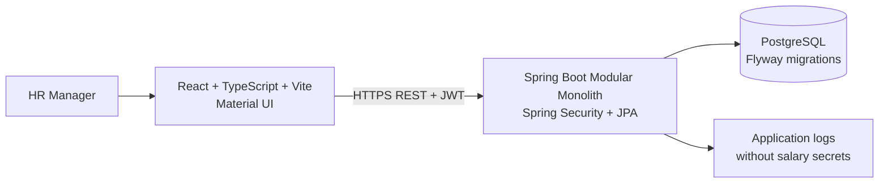
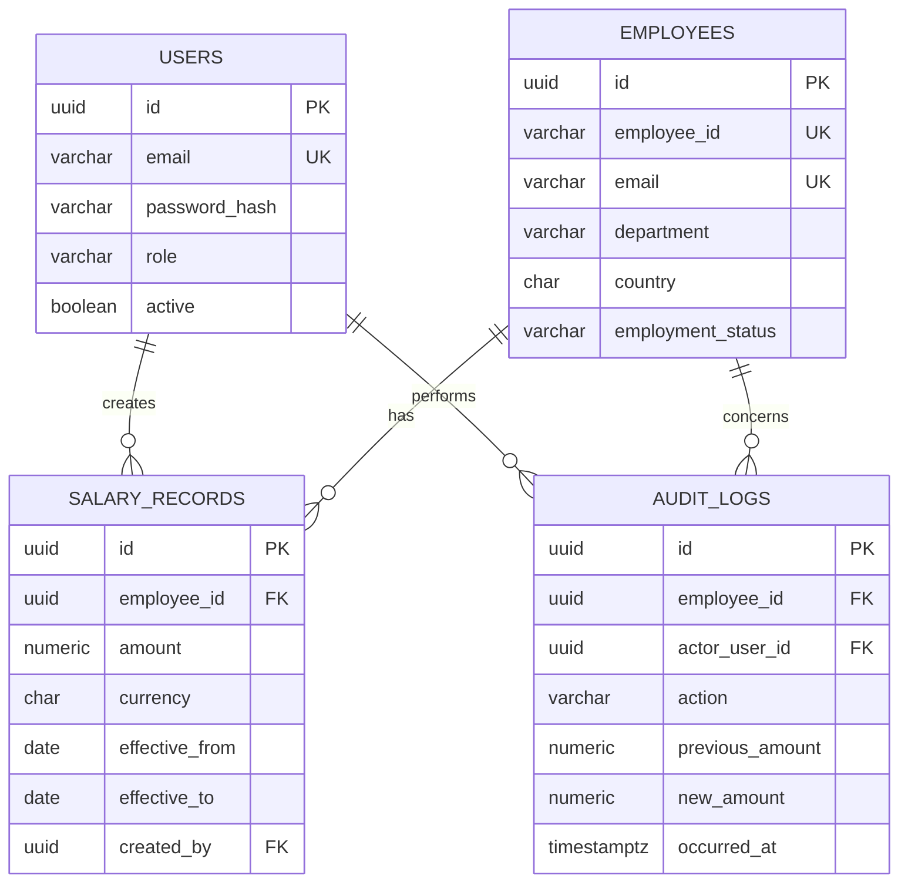
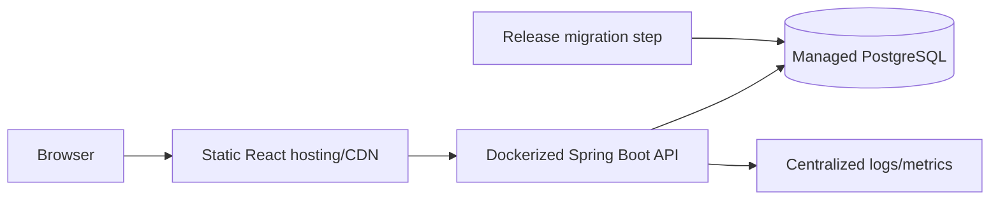

# ACME Employee Salary Management Architecture

**Status:** Proposed MVP architecture  
**Source of truth:** [Product Requirements Document](requirements.md)  
**Date:** September 22, 2026

## 1. Architecture Summary

The MVP is a modular monolith: one React application, one Spring Boot deployment, and one PostgreSQL database. Modules are separated by business capability inside the backend, but are deployed and operated together. This keeps the assessment simple to run and easy to evolve while preserving clear ownership boundaries.



Recommended repository structure:

```text
.
├── docs/
│   ├── requirements.md
│   ├── architecture.md
│   ├── tradeoffs.md
│   └── performance.md
├── frontend/
│   ├── src/
│   │   ├── app/                 # router, providers, app shell
│   │   ├── components/          # small shared UI components
│   │   ├── features/
│   │   │   ├── auth/
│   │   │   ├── employees/
│   │   │   ├── salary/
│   │   │   └── dashboard/
│   │   ├── services/            # HTTP client and API modules
│   │   ├── types/
│   │   └── main.tsx
│   ├── public/
│   └── package.json
├── backend/
│   ├── src/main/java/com/acme/esm/
│   │   ├── auth/
│   │   ├── employees/
│   │   ├── salary/
│   │   ├── dashboard/
│   │   ├── audit/
│   │   ├── common/
│   │   └── config/
│   ├── src/main/resources/db/migration/
│   ├── src/test/java/
│   └── pom.xml
├── docker-compose.yml
└── README.md
```

## 2. React Architecture

### Feature organization

Each feature owns its pages, API calls, types, validation schemas, and feature-specific components. Shared components contain only genuinely reusable behavior such as `DataTable`, `FormField`, `CurrencyAmount`, `EmptyState`, and `ErrorState`. Avoid a global component abstraction for one-off screens.

`app/` owns the router, application providers, authenticated shell, and route-level error boundary. `services/httpClient.ts` owns the base URL, JSON handling, JWT attachment, and common error parsing. Feature service files call that client and expose typed functions such as `listEmployees` and `createSalaryRecord`.

### Routing and authentication

Routes:

- `/login`: public login form.
- `/employees`: protected, paginated directory.
- `/employees/:id`: protected employee details and current salary.
- `/employees/:id/salary-history`: protected salary timeline and update form.
- `/dashboard`: protected analytics view.

An `AuthProvider` stores the short-lived access token in memory where practical, restores a session only through a controlled session mechanism, and exposes `user`, `isAuthenticated`, `login`, and `logout`. The HTTP client adds `Authorization: Bearer <token>`. `ProtectedRoute` redirects unauthenticated users to `/login`; the backend remains the authority and must authorize every request.

For this MVP there is one `HR_MANAGER` role. The client may hide controls based on authentication state, but hiding controls is not security.

### Forms and states

Use React Hook Form with schema validation (for example, Zod) for login, employee, and salary forms. Server validation remains authoritative. Forms show field-level errors, preserve user input after recoverable failures, and disable duplicate submissions.

Every page defines loading, empty, error, and success states. Tables use stable row dimensions and server-provided pagination metadata. Mutations invalidate or refetch the affected query instead of maintaining duplicate local copies of server state. Keep list query state in the URL so search, filters, sorting, and page can be shared and restored.

### Server-side pagination and filtering

`GET /api/employees` accepts `page`, `size`, `sort`, `direction`, and filter parameters. The UI requests only the visible page, with a bounded maximum page size. Debounce free-text search and reset the page to zero when filters change. The backend uses parameterized Spring Data specifications or explicit query methods and returns a page DTO, never the full employee set.

## 3. Spring Boot Modular Monolith

Use package-by-feature with internal layers:

```text
com.acme.esm
├── auth/
│   ├── AuthController, AuthService, UserRepository
│   ├── LoginRequest, LoginResponse, AuthUserDto
│   └── JwtAuthenticationFilter, PasswordConfig
├── employees/
│   ├── EmployeeController, EmployeeService, EmployeeRepository
│   ├── Employee, EmployeeDto, EmployeeRequest
│   └── EmployeeSpecifications
├── salary/
│   ├── SalaryController, SalaryService, SalaryRecordRepository
│   ├── SalaryRecord, SalaryDto, SalaryUpdateRequest
│   └── SalaryHistoryPolicy
├── dashboard/
│   ├── DashboardController, DashboardService
│   ├── projection/query repositories, response DTOs
│   └── salary-band and FX normalization policy
├── audit/
│   ├── AuditLog, AuditLogRepository, AuditService
│   └── AuditDto
├── common/
│   ├── ApiError, PageResponse, validation, exception handling
│   └── Clock and correlation-id support
└── config/
    ├── SecurityConfig, JacksonConfig, CorsConfig
    └── OpenApiConfig
```

Controllers translate HTTP requests and responses only. Services own business rules and transaction boundaries. Repositories perform persistence and projections. DTOs are the REST contract; JPA entities never cross the controller boundary. Bean Validation handles shape and basic constraints, while services handle cross-record rules such as salary-date conflicts and duplicate employee identity.

A `@RestControllerAdvice` maps validation failures, not-found errors, conflicts, authentication failures, authorization failures, and unexpected errors to one stable error format. Unexpected errors are logged with a correlation ID but do not expose stack traces or salary data.

## 4. Database Design

PostgreSQL is the system of record. Flyway owns all schema changes. IDs use UUIDs generated by the application or database; employee IDs remain human-readable unique identifiers.

### Core schema

- **users**
  - `id UUID PRIMARY KEY`
  - `email VARCHAR(320) NOT NULL UNIQUE`
  - `password_hash VARCHAR(255) NOT NULL`
  - `role VARCHAR(32) NOT NULL CHECK (role = 'HR_MANAGER')`
  - `active BOOLEAN NOT NULL DEFAULT TRUE`
  - `created_at TIMESTAMPTZ NOT NULL`, `updated_at TIMESTAMPTZ NOT NULL`
- **employees**
  - `id UUID PRIMARY KEY`
  - `employee_id VARCHAR(32) NOT NULL UNIQUE`
  - `first_name VARCHAR(100) NOT NULL`, `last_name VARCHAR(100) NOT NULL`
  - `email VARCHAR(320) NOT NULL UNIQUE`
  - `department VARCHAR(100) NOT NULL`, `job_title VARCHAR(150) NOT NULL`
  - `country CHAR(2) NOT NULL` (ISO 3166-1 alpha-2)
  - `employment_status VARCHAR(20) NOT NULL CHECK (employment_status IN ('ACTIVE','INACTIVE'))`
  - `created_at TIMESTAMPTZ NOT NULL`, `updated_at TIMESTAMPTZ NOT NULL`
- **salary_records**
  - `id UUID PRIMARY KEY`
  - `employee_id UUID NOT NULL REFERENCES employees(id)`
  - `amount NUMERIC(19,4) NOT NULL CHECK (amount >= 0)`
  - `currency CHAR(3) NOT NULL` (validated against supported ISO codes)
  - `effective_from DATE NOT NULL`
  - `effective_to DATE NULL`
  - `created_by UUID NOT NULL REFERENCES users(id)`
  - `created_at TIMESTAMPTZ NOT NULL`
  - `UNIQUE (employee_id, effective_from)`
- **audit_logs**
  - `id UUID PRIMARY KEY`
  - `employee_id UUID NOT NULL REFERENCES employees(id)`
  - `actor_user_id UUID NOT NULL REFERENCES users(id)`
  - `action VARCHAR(40) NOT NULL`
  - `previous_amount NUMERIC(19,4) NULL`, `previous_currency CHAR(3) NULL`, `previous_effective_from DATE NULL`
  - `new_amount NUMERIC(19,4) NULL`, `new_currency CHAR(3) NULL`, `new_effective_from DATE NULL`
  - `occurred_at TIMESTAMPTZ NOT NULL`
  - `metadata JSONB NOT NULL DEFAULT '{}'`
- **fx_reference_rates**
  - `base_currency CHAR(3) NOT NULL`, `quote_currency CHAR(3) NOT NULL`
  - `rate NUMERIC(19,8) NOT NULL CHECK (rate > 0)`
  - `as_of_date DATE NOT NULL`
  - `PRIMARY KEY (base_currency, quote_currency, as_of_date)`

The salary table should also enforce non-overlapping effective ranges. The service sets the prior record's `effective_to` to the day before a new record starts. A PostgreSQL exclusion constraint using `daterange(effective_from, COALESCE(effective_to + 1, 'infinity'::date), '[)')` and `employee_id WITH =` is recommended after enabling `btree_gist`; the service lock remains necessary for friendly conflict handling.

Indexes:

- `employees(employee_id)` and `employees(lower(email))` for exact identity lookups.
- `employees(lower(last_name), lower(first_name))` and optionally a `pg_trgm` index for name search.
- `employees(department, employment_status)`, `employees(country, employment_status)`, and `employees(employment_status)` for common filters.
- `salary_records(employee_id, effective_from DESC)` for current/history queries.
- `salary_records(currency, amount)` and `salary_records(effective_from)` for bounded analytics.
- `audit_logs(employee_id, occurred_at DESC)` for history display.
- Add indexes only for measured query patterns; every index increases write and seed cost.

### Entity relationships



## 5. Salary History and Consistency

A salary update inserts a new immutable `salary_records` row; it never overwrites the old amount. A record is current when its effective date is the latest date on or before the reporting date and its range contains that date. Future-dated records remain visible as scheduled changes but do not become current early.

`SalaryService.updateSalary` runs in one database transaction:

1. Lock the employee's salary rows or employee row using `SELECT ... FOR UPDATE`.
2. Validate amount, currency, effective date, and whether the date conflicts with an existing record.
3. Close the prior range if appropriate.
4. Insert the new salary record.
5. Insert the audit log with previous and new values.
6. Commit all changes together.

Concurrent updates for the same employee serialize on the lock. A unique constraint and exclusion constraint are final database safeguards; a conflict becomes HTTP `409 Conflict`. The application clock is injected for tests, while persisted timestamps use UTC.

## 6. Auditability

Audit information belongs in a dedicated append-only `audit_logs` table. It supports an efficient employee timeline, separates compliance history from mutable business state, and avoids relying on application logs. Salary mutations must include employee, actor, timestamp, action, previous value, and new value. Ordinary API operations provide no delete or update path for audit rows. Database permissions should also prevent the application role from deleting audit history.

## 7. Authentication and Security

The login flow is:

1. HR Manager submits email and password to `POST /api/auth/login` over HTTPS.
2. Spring Security loads the active user and compares the password with a strong adaptive hash such as BCrypt or Argon2.
3. On success, the server returns a short-lived signed JWT containing subject, role, issuer, and expiry.
4. The React client sends the token on protected requests.
5. `JwtAuthenticationFilter` validates signature, issuer, expiry, and user status before the controller runs.
6. Logout clears client state; token revocation is limited in this MVP by using short expiry. A refresh-token strategy can be added later if needed.

Keep JWT signing keys and database credentials outside source control, supplied through deployment secrets. Configure an explicit CORS allowlist. Use parameterized JPA queries, Bean Validation, output encoding, HTTPS, safe error messages, rate limiting at the deployment edge where available, and structured logs that exclude passwords, JWTs, and unnecessary salary details.

## 8. REST API Contract

All protected endpoints require a valid HR Manager JWT. JSON responses use ISO-8601 timestamps and ISO currency codes. List endpoints return `{ "items": [], "page": 0, "size": 25, "totalItems": 0, "totalPages": 0 }`.

| Method and path                          | Purpose, request, response, validation, authorization, status                                                                                                                                                                                                            |
| ---------------------------------------- | ------------------------------------------------------------------------------------------------------------------------------------------------------------------------------------------------------------------------------------------------------------------------ |
| `POST /api/auth/login`                   | Body `{email,password}`. Returns `{accessToken, tokenType, expiresAt, user}`. Validate required email/password; return `200`, `400`, or `401` without revealing which credential failed. Public.                                                                         |
| `GET /api/employees`                     | Query `page,size,sort,direction,employeeId,query,department,country,currency,status,minSalary,maxSalary`. Returns paged employee summary DTOs with current salary. Validate bounded page size, sort allowlist, ISO codes, non-negative ranges. HR Manager; `200`, `400`. |
| `GET /api/employees/{id}`                | Returns employee detail, current salary, and scheduled next change. Validate UUID; `200`, `400`, `404`. HR Manager.                                                                                                                                                      |
| `POST /api/employees`                    | Body `{employeeId,firstName,lastName,email,department,jobTitle,country,status,initialSalary}`. Validate required fields, email, country, status, currency, non-negative amount, and initial effective date. Returns created DTO; `201`, `400`, `409`. HR Manager.        |
| `PUT /api/employees/{id}`                | Body contains editable employee profile fields. Validate same identity and enum rules; employee ID/email uniqueness returns `409`. Returns updated DTO; `200`, `400`, `404`, `409`. HR Manager.                                                                          |
| `PATCH /api/employees/{id}/deactivate`   | Optional body `{effectiveDate}`. Marks employment inactive without deleting history. Returns updated employee; `200`, `400`, `404`. HR Manager.                                                                                                                          |
| `GET /api/employees/{id}/salary-history` | Returns ordered salary DTOs including effective ranges and creator summary. `200`, `400`, `404`. HR Manager.                                                                                                                                                             |
| `POST /api/employees/{id}/salary`        | Body `{amount,currency,effectiveFrom}`. Validate non-negative amount, supported currency, date policy, and range conflicts. Returns new salary DTO and audit ID; `201`, `400`, `404`, `409`. HR Manager.                                                                 |
| `GET /api/dashboard/summary`             | Optional `asOfDate`, country, department, status. Returns counts and min/max/average grouped by currency, never a cross-currency total. `200`, `400`. HR Manager.                                                                                                        |
| `GET /api/dashboard/by-country`          | Returns country headcount and salary statistics grouped by currency, optionally normalized with reference FX metadata. `200`, `400`. HR Manager.                                                                                                                         |
| `GET /api/dashboard/by-department`       | Returns department headcount and salary statistics grouped by currency. `200`, `400`. HR Manager.                                                                                                                                                                        |
| `GET /api/dashboard/salary-bands`        | Returns counts by configured band, currency, and grouping dimensions; normalized bands require documented reference currency/rates. `200`, `400`. HR Manager.                                                                                                            |

Global error shape:

```json
{
  "timestamp": "2026-09-22T10:15:30Z",
  "status": 400,
  "code": "VALIDATION_ERROR",
  "message": "Request validation failed",
  "fieldErrors": [
    { "field": "currency", "message": "Must be a supported ISO 4217 code" }
  ],
  "correlationId": "7f9d..."
}
```

## 9. Search, Pagination, and Analytics

Employee search is database-backed. Exact employee ID and email use indexed equality predicates. Name search uses normalized columns and, if substring search is required, `pg_trgm`. Department, country, currency, and status use indexed filters. Salary range filtering joins or uses an indexed salary projection/query on the effective current record. Sort fields are allowlisted to prevent arbitrary SQL ordering.

Dashboard queries select current salary records using a database query or CTE, then aggregate with `COUNT`, `MIN`, `MAX`, and `AVG` grouped by country, department, currency, and configured salary band. Never sum or average raw INR, USD, and GBP amounts together. Store original amounts and currencies as authoritative values.

For the MVP, use a versioned static FX table with a designated reporting currency such as USD. A normalized figure is `amount * rate(currency -> USD)` using the selected `as_of_date`; it is clearly labeled as a reference estimate, not payroll value. Cross-currency average/min/max may be shown only for normalized values and must include the rate date. Raw statistics always remain grouped by currency.

## 10. Validation Rules

- Employee ID and email are required and unique, case-normalized for comparison.
- Names, department, and job title are required and length-bounded.
- Country must be a supported ISO 3166-1 alpha-2 code.
- Currency must be a supported ISO 4217 code.
- Salary must be numeric, non-negative, and within the currency's supported precision.
- Effective dates must be valid; a new record cannot create overlapping salary ranges.
- A duplicate employee identity returns `409 Conflict`, not a generic server error.
- Salary history is immutable; corrections are new records.

## 11. Deterministic Seeding

Implement a development/test seed command or profile that first checks a stable seed marker, then creates exactly 10,000 synthetic employees and one initial salary record per employee in one controlled batch process. Use a fixed seed such as `20260922`, deterministic employee IDs (`ACME-000001` through `ACME-010000`), generated names, and no real personal data. Distribute fixed values across countries, departments, job titles, currencies, salary ranges, and active/inactive statuses.

Use an idempotency marker such as `seed_runs(seed_name, seed_version, completed_at)` plus unique employee IDs. Re-running the same version should do nothing or fail clearly; a new version should be an explicit migration/seed version rather than silently duplicating data. Batch inserts, prepared statements, and transaction boundaries keep the seed predictable and fast.

## 12. Testing Strategy

- **Service unit tests:** employee validation, duplicate handling, salary effective-date rules, currency rules, deactivation, audit creation, and concurrency/conflict behavior using Mockito where appropriate.
- **Repository/database tests:** Testcontainers PostgreSQL or an equivalent real PostgreSQL test profile for constraints, indexes/query semantics, current-salary selection, aggregation, and Flyway migrations.
- **Controller/integration tests:** Spring Boot tests for DTO validation, status codes, error shape, authorization, and end-to-end salary update transaction behavior.
- **Authentication tests:** password verification, inactive user rejection, JWT expiry/signature/issuer checks, protected endpoint access, and CORS configuration.
- **Frontend tests:** route protection, form validation, table query parameters, loading/error/empty states, and mutation refresh behavior.
- **Strongest business coverage:** salary history preservation, no overlapping effective ranges, audit previous/new values, currency-aware analytics, and employee authorization.

## 13. Deployment



For a take-home deployment, build the React app into static assets hosted by a CDN or simple static host, run Spring Boot as one Docker container, and use managed PostgreSQL. Docker Compose should provide local React/API/PostgreSQL development and Flyway migration execution. Production configuration comes from environment variables or a secret manager; never bake secrets into images or commit `.env` files. Run migrations as a controlled release step, back up managed PostgreSQL, and expose only HTTPS and the required API origin.

## 14. Recommended Implementation Phases

1. Establish repository skeleton, Docker Compose, Spring Boot/React scaffolds, configuration, and Flyway baseline.
2. Implement users, JWT login, password hashing, security filter, and protected route shell.
3. Implement employees, validation, list/search/filter/pagination, profile APIs, and directory UI.
4. Implement salary records, transaction-safe history updates, audit logs, and salary timeline/update UI.
5. Implement database-side dashboard projections, currency-aware reporting, static FX data, and dashboard UI.
6. Add deterministic 10,000-record seed, representative fixtures, Testcontainers, integration tests, and frontend tests.
7. Harden deployment configuration, error handling, observability, accessibility, documentation, and performance checks.

## 15. Files for This Phase

Created or updated in this architecture phase:

- `docs/architecture.md`
- `docs/tradeoffs.md`
- `docs/performance.md`

No application implementation code is created in this phase.

Suggested commit message: `docs: define MVP modular monolith architecture`
